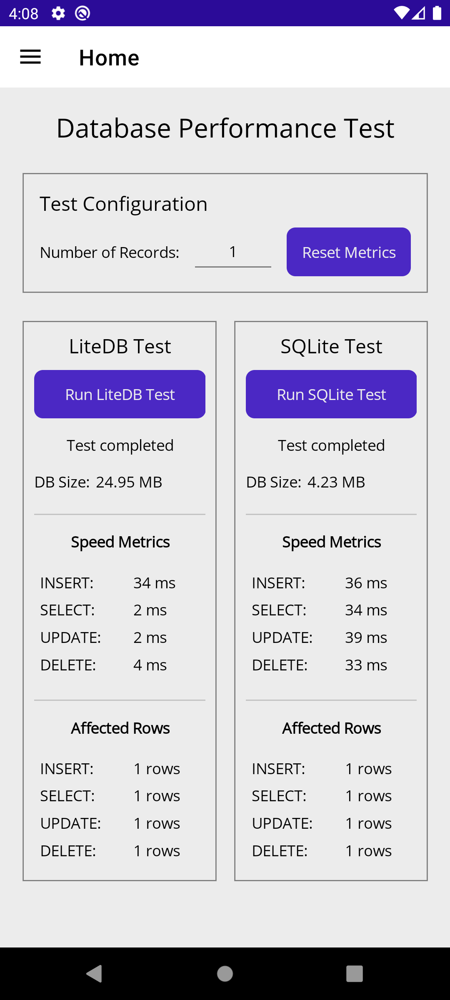
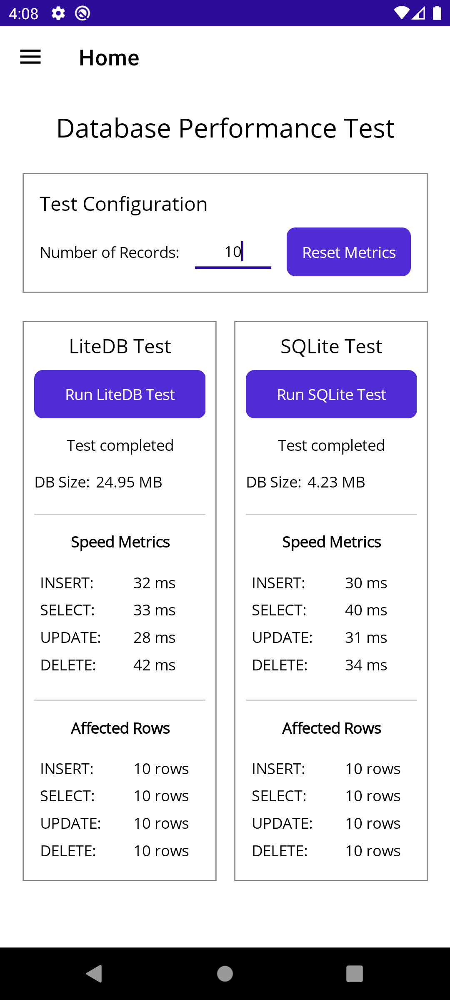
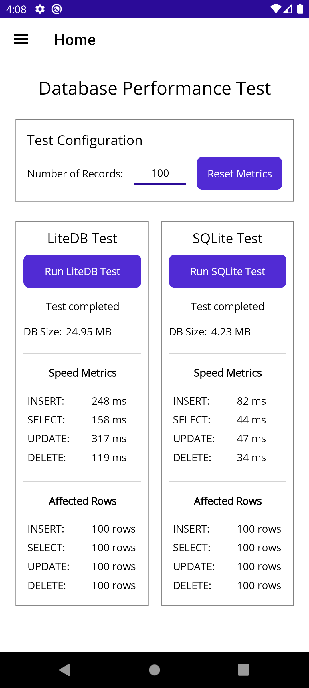
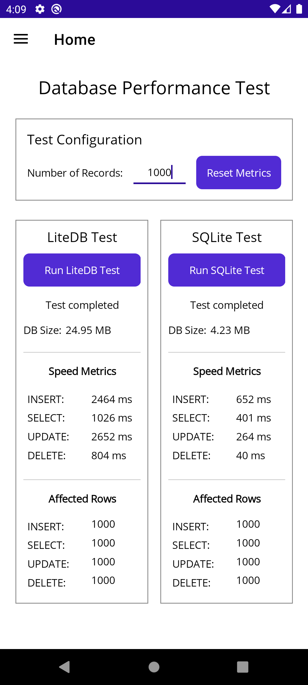
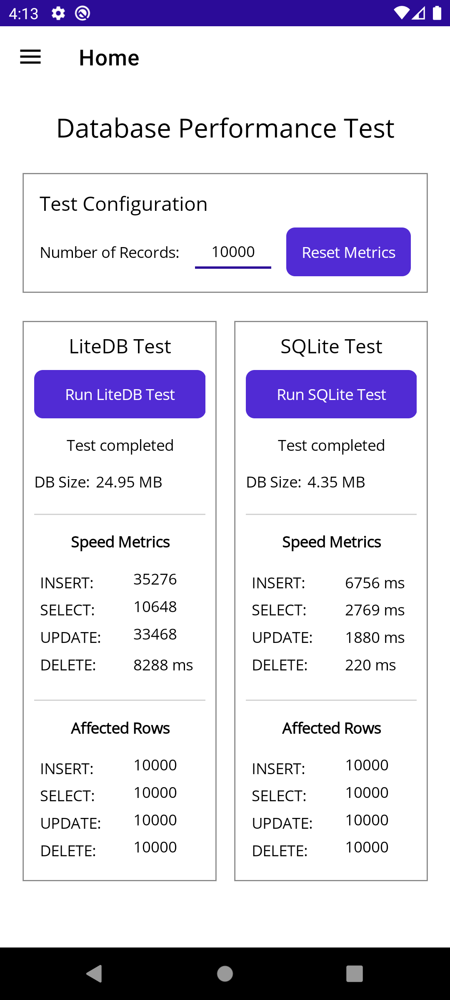

# LocalDBTest

## Purpose

This repository is designed to compare the performance of two common embedded databases, namely SQLite and LiteDB, in .NET MAUI applications. The project can be easily deployed to devices, emulators, and other MAUI target frameworks. Users can run the app and press the 'Run Test' buttons for each database engine to see the performance metrics.

## Getting Started

1. Clone the repository to your local machine.
2. Open the solution file `LocalDBTest.sln` in Visual Studio.
3. Deploy the app to your desired target (device, emulator, etc.).
4. Run the app and press the 'Run Test' buttons for SQLite and LiteDB to collect performance metrics.

The local database is cleared at the beginning of each test run.

## Metrics Collected

The app collects the following performance metrics for each database engine:

- **Insertion Time**: The time taken to insert a set number of records into the database.
- **Query Time**: The time taken to query a set number of records from the database.
- **Update Time**: The time taken to update a set number of records in the database.
- **Deletion Time**: The time taken to delete a set number of records from the database.

## Interpreting the Results

- **Lower Insertion Time**: Indicates faster data insertion performance.
- **Lower Query Time**: Indicates faster data retrieval performance.
- **Lower Update Time**: Indicates faster data update performance.
- **Lower Deletion Time**: Indicates faster data deletion performance.

By comparing these metrics, users can determine which database engine performs better under different operations in a .NET MAUI application.

The number of rows are mainly to ascertain that the operations are performed correctly. SQLite is optimized for batch transactions, while LiteDB is optimized to have all data in single collection / document. While there is a large room for optimization in the code for both databased, it's a reasonable estimate of the performance of both databased under similar conditions.

I haven't figured out yet why the database size doesn't change significantly despite increase in number of rows. The test reports the size after the UPDATE statement.

## Screenshots

Here are some screenshots of the app in action (Android emulator - Pixel 7):

